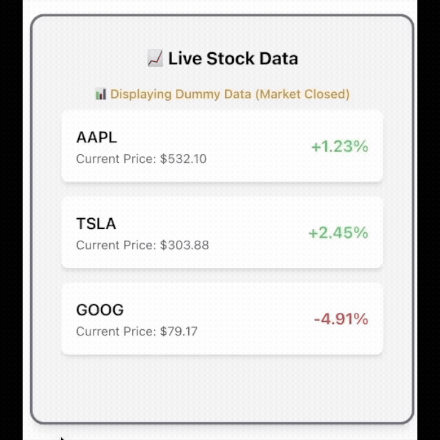

# Smart Dashboard

A powerful and dynamic web application designed for managing notes, viewing news, seeing your current weather and viewing stocks in real time, built using Next.js, Express, MySQL, and WebSocket. This app allows users to create, view, update, and delete personal notes with an intuitive UI.

## Features:
- **Real-time data**: Leverage WebSocket integration to get live updates on stock data.
- **User authentication**: Secure login system to manage personal notes.
- **CRUD functionality**: Add, view, update, and delete notes seamlessly.
- **Responsive UI**: TailwindCSS for a sleek and responsive design.

## Samples:
### Main UI:

### Registration:

### Login:

### Notes:

### Stock Widget:
